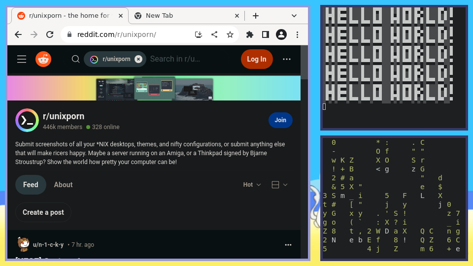

# Zelo

This is a window manager written in python. I made it primarily because i don't like how gnome manages windows.

# Support

- only x11, but i am going to work on wayland support
- extensions
- no ewmh currently
- no icccm currently

# extensions

See [extensions/readme.md](./extensions/readme.md) for a guide on configuring extensions and what they do.

# Installation

## Debian or Ubuntu

There is currently an install script, located in ``scripts/setup.sh``, but it works only on Debian
and Ubuntu (i have tested it on both).

## Anything else

If you are running anything unsupported by the install script, you need to do the following:

- dowload the following dependencies: ``libxcb-util-dev libx11-xcb-dev libxcb-keysyms1-dev libxcb-image0-dev libxcb-randr0-dev python3``

- run ``pip3 install -r requirements.py`` or install the following modules from your package manager: ``python3-cffi python3-opencv``

- run ``./scripts/keysyms.sh``

> [!TIP]
> ***(Optionally)*** run ``sudo ./scripts/Xsession.sh`` to add the window manager to your xsession directory and also add it to /bin

# Updating

To update, run ``./scripts/update.sh``. It will keep all the changes you have applied.

# Bugs

This is a section dedicated to bugs that i know of and will think about solving.

- qt apps do not work, unless you delete ``~/.local/lib/python3.10/site-packages/cv2/qt/plugins/platforms/libqxcb.so`` (not sure if it's just on my system)
- apps that cannot be resized are kinda jank and dont really work well
- x11 image is ignoring redraw stuff
- no "graceful" stopping of apps
- mouse themeing doesn't work for some reason

# Configuring

The configuration is held in ``cfg.py``, there you can put shortcuts, extensions and their config, and what to be run when the window manager starts. I might add more info about how to configure the window manager.

# Docs

Currently there are only docs for configuring extensions, but nothing else.

# Images

